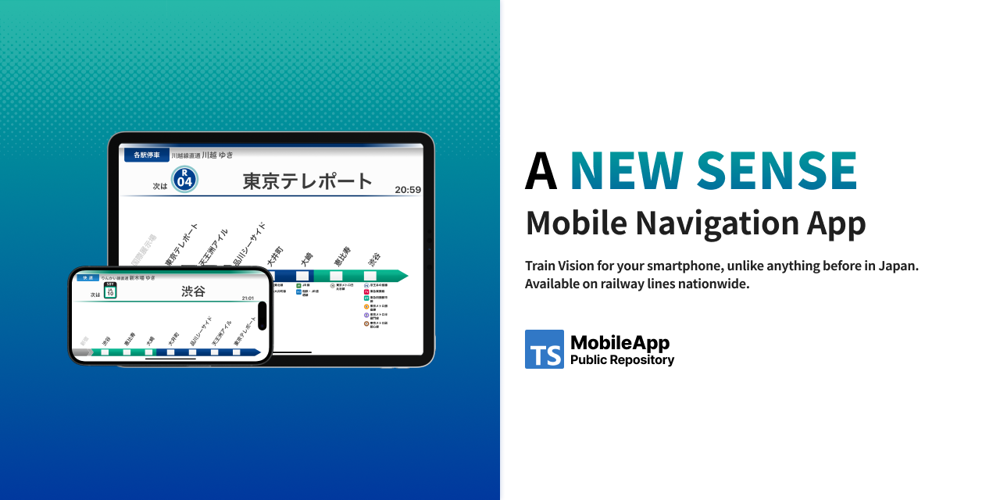

# TrainLCD



<!-- ALL-CONTRIBUTORS-BADGE:START - Do not remove or modify this section -->

[](#contributors-)

<!-- ALL-CONTRIBUTORS-BADGE:END -->


[](http://makeapullrequest.com)

**TrainLCD is a mobile application that simulates Japanese railway company LCDs, providing real-time navigation and station information for train passengers.**

This app recreates the authentic experience of Japanese train travel by displaying station information in the same style as actual train LCD screens. Whether you're a tourist visiting Japan, a daily commuter, or simply fascinated by Japanese railway systems, TrainLCD offers an immersive and practical navigation experience.

## Table of Contents

- [Screenshots](#screenshots)
- [Features](#features)
- [Getting Started](#getting-started)
  - [Prerequisites](#prerequisites)
  - [Installation](#installation)
  - [Running the App](#running-the-app)
- [Download](#download)
- [Development](#development)
  - [Project Structure](#project-structure)
  - [Available Scripts](#available-scripts)
  - [Testing](#testing)
- [Contributing](#contributing)
- [Code of Conduct](#code-of-conduct)
- [Architecture](#architecture)
- [Support](#support)
- [Join our Community](#join-our-community)
- [Data Sources](#data-sources)
- [Contributors](#contributors-)
- [Related Projects](#related-projects)
- [License](#license)

## Screenshots

<!-- Add screenshots here when available -->
*Screenshots and demo videos coming soon...*

## Features

- **🚆 Authentic LCD**: Experience genuine Japanese train LCD interfaces with accurate styling from major railway companies
- **📍 Real-time Location Tracking**: Automatically detect your current position and display relevant station information
- **🔔 Smart Notifications**: Get notified when approaching or arriving at your destination station
- **🎨 Multiple Themes**: Choose from various railway company themes including JR East, JR West, Tokyo Metro, and more
- **📱 Cross-platform**: Available on both iOS and Android devices
- **🌐 Offline Support**: Core functionality works without internet connection
- **🗾 Comprehensive Coverage**: Supports major railway lines across Japan

## Getting Started

### Prerequisites

Before you begin, ensure you have met the following requirements:

- **Node.js 20.x**
- **pnpm 10.x** (use the globally installed pnpm binary)
- **React Native development environment** set up
- **Expo CLI** installed globally
- **Firebase CLI** (for Cloud Functions development)
- **Android Studio** (for Android development)
- **Xcode** (for iOS development, macOS only)

### Installation

1. Clone the repository:
   ```bash
   git clone https://github.com/TrainLCD/MobileApp.git
   cd MobileApp
   ```

2. Install dependencies:
   ```bash
   pnpm install
   ```

   Note: Configure `GQL_API_URL` before running `pnpm gql:codegen` to regenerate GraphQL types.

### Running the App

#### Development Mode

To start the development server:

```bash
pnpm start
```

#### Platform-specific Commands

- **iOS**: `pnpm ios`
- **Android**: `pnpm android`
- **Web**: `pnpm web`

## Download

[](https://play.google.com/store/apps/details?id=me.tinykitten.trainlcd)
[](https://apps.apple.com/jp/app/trainlcd/id1486355943)

## Join our Community

If you like this project, join our Discord community!  
**NOTE: English is welcome, but in the community, we usually use Japanese for discussions, announcements, etc.**
[https://discord.gg/7sQhQhnvvw](https://discord.gg/7sQhQhnvvw)

## Development

### Project Structure

```text
src/
├── components/        # Reusable UI components
├── screens/           # Screen components
├── hooks/             # Custom React hooks
├── store/             # Zustand stores and selectors
├── stacks/            # React Navigation stack definitions
├── providers/         # Context providers and integration wrappers
├── lib/               # API clients and shared integrations
├── config/            # Static configuration helpers
├── constants/         # Shared constants
├── utils/             # Utility functions and test helpers
├── test/              # Testing utilities and e2e harness
├── __mocks__/         # Jest mocks
├── __fixtures__/      # Test fixtures
├── @types/            # Global TypeScript declarations
├── models/            # Data models
├── index.tsx          # App entry point
├── translation.ts     # i18n resources
└── lineSymbolImage.ts # Line symbol metadata

android/               # Native Android project
ios/                   # Native iOS project
functions/             # Firebase Cloud Functions
docs/                  # Architectural notes and runbooks
assets/                # Static media bundled with the app
utils/                 # Tooling scripts and codegen helpers
```

### Available Scripts

- `pnpm start` - Start the Expo development server
- `pnpm android` / `pnpm ios` - Build and launch native binaries
- `pnpm web` - Serve the Expo web build
- `pnpm lint` - Run Biome linter
- `pnpm format` - Format code with Biome
- `pnpm test` - Run Jest tests
- `pnpm typecheck` - Run TypeScript type checking
- `pnpm watch:test` - Run tests in watch mode
- `pnpm gql:codegen` - Regenerate GraphQL types after schema or documents change (requires `GQL_API_URL`)

### Testing

This project uses Jest for testing. Run the test suite with:

```bash
pnpm test
```

For watch mode during development:

```bash
pnpm watch:test
```

### Firebase Cloud Functions

This project includes Firebase Cloud Functions located in the `functions/` directory. To work with Cloud Functions:

1. Navigate to the functions directory:
   ```bash
   cd functions
   ```

2. Install function dependencies:
   ```bash
   npm install
   ```

3. Build the functions:
   ```bash
   npm run build
   ```

4. Run functions locally (requires Firebase CLI):
   ```bash
   firebase emulators:start
   ```

## Contributing

We welcome contributions from the community! Here's how you can help:

### How to Contribute

1. **Fork the repository**
2. **Create a feature branch**: `git checkout -b feature/amazing-feature`
3. **Make your changes** and ensure they follow our coding standards
4. **Run tests**: `pnpm test`
5. **Run linting**: `pnpm lint`
6. **Commit your changes**: `git commit -m 'Add some amazing feature'`
7. **Push to the branch**: `git push origin feature/amazing-feature`
8. **Open a Pull Request**

### Development Guidelines

- Follow the existing code style and conventions
- Write clear, descriptive commit messages
- Add tests for new features
- Update documentation as needed
- Ensure all tests pass before submitting

### Reporting Issues

If you encounter any bugs or have feature requests:

1. Check if the issue already exists in our [Issues](https://github.com/TrainLCD/MobileApp/issues)
2. If not, create a new issue with:
   - Clear description of the problem
   - Steps to reproduce (for bugs)
   - Expected vs actual behavior
   - Device/platform information
   - Screenshots if applicable

## Code of Conduct

This project adheres to a code of conduct that we expect all contributors to follow. Please be respectful and professional in all interactions.

### Our Standards

- Be welcoming and inclusive
- Respect differing viewpoints and experiences
- Give and gracefully accept constructive feedback
- Focus on what is best for the community
- Show empathy towards other community members

## Architecture

TrainLCD is built with:

- **React Native** with **Expo** - Cross-platform mobile development
- **TypeScript** - Type safety and better developer experience
- **React Navigation** - Navigation library
- **Tanstack Query** - Data fetching and caching
- **Firebase** - Backend services (Analytics, Auth, Firestore, Storage)
- **Sentry** - Error tracking and performance monitoring
- **GraphQL** with Code Generator - Typed queries and operations

## Support

### Community Support

- Join our [Discord community](https://discord.gg/7sQhQhnvvw) for discussions and support
- Check out existing [Issues](https://github.com/TrainLCD/MobileApp/issues) and [Discussions](https://github.com/TrainLCD/MobileApp/discussions)

### Professional Support

For professional support or custom development, please contact the maintainers.

## Acknowledgments

- Thanks to all contributors who have helped improve this project
- Special thanks to the Japanese railway companies for providing inspiration
- The open-source community for the excellent tools and libraries

## Data Sources

- Bus-related data provided by [Tokyo Metropolitan Bureau of Transportation (Toei)](https://www.kotsu.metro.tokyo.jp/), licensed under [CC BY 4.0](https://creativecommons.org/licenses/by/4.0/)
- Station data provided by [駅データ.jp](https://www.ekidata.jp/)

## Contributors ✨

Thanks goes to these wonderful people ([emoji key](https://allcontributors.org/docs/en/emoji-key)):

<!-- ALL-CONTRIBUTORS-LIST:START - Do not remove or modify this section -->
<!-- prettier-ignore-start -->
<!-- markdownlint-disable -->
<table>
  <tbody>
    <tr>
      <td align="center" valign="top" width="14.28%"><a href="https://github.com/makotia"><br /><sub><b>makotia</b></sub></a><br /><a href="https://github.com/TrainLCD/MobileApp/commits?author=makotia" title="Documentation">📖</a> <a href="#userTesting-makotia" title="User Testing">📓</a> <a href="https://github.com/TrainLCD/MobileApp/pulls?q=is%3Apr+reviewed-by%3Amakotia" title="Reviewed Pull Requests">👀</a></td>
      <td align="center" valign="top" width="14.28%"><a href="https://sw-saturn.dev"><br /><sub><b>Kanta Demizu</b></sub></a><br /><a href="#data-Sw-Saturn" title="Data">🔣</a> <a href="#userTesting-Sw-Saturn" title="User Testing">📓</a> <a href="https://github.com/TrainLCD/MobileApp/pulls?q=is%3Apr+reviewed-by%3ASw-Saturn" title="Reviewed Pull Requests">👀</a></td>
      <td align="center" valign="top" width="14.28%"><a href="https://nrsy.jp"><br /><sub><b>SAIGUSA Tomotada</b></sub></a><br /><a href="#userTesting-10mocy" title="User Testing">📓</a> <a href="#data-10mocy" title="Data">🔣</a></td>
      <td align="center" valign="top" width="14.28%"><a href="https://github.com/kokoa0429"><br /><sub><b>yasuto masuda</b></sub></a><br /><a href="#userTesting-kokoa0429" title="User Testing">📓</a></td>
      <td align="center" valign="top" width="14.28%"><a href="https://kataba.me"><br /><sub><b>Katabame Miaya</b></sub></a><br /><a href="#data-katabame" title="Data">🔣</a> <a href="#userTesting-katabame" title="User Testing">📓</a> <a href="https://github.com/TrainLCD/MobileApp/commits?author=katabame" title="Documentation">📖</a></td>
      <td align="center" valign="top" width="14.28%"><a href="http://coderabbit.ai"><br /><sub><b>CodeRabbit</b></sub></a><br /><a href="https://github.com/TrainLCD/MobileApp/pulls?q=is%3Apr+reviewed-by%3Acoderabbitai" title="Reviewed Pull Requests">👀</a></td>
    </tr>
  </tbody>
</table>

<!-- markdownlint-restore -->
<!-- prettier-ignore-end -->

<!-- ALL-CONTRIBUTORS-LIST:END -->

This project follows the [all-contributors](https://github.com/all-contributors/all-contributors) specification. Contributions of any kind welcome!

## Related Projects

- [StationAPI](https://github.com/TinyKitten/StationAPI) - Backend API for station data


## License

This project is licensed under the MIT License - see the [LICENSE](LICENSE) file for details.
