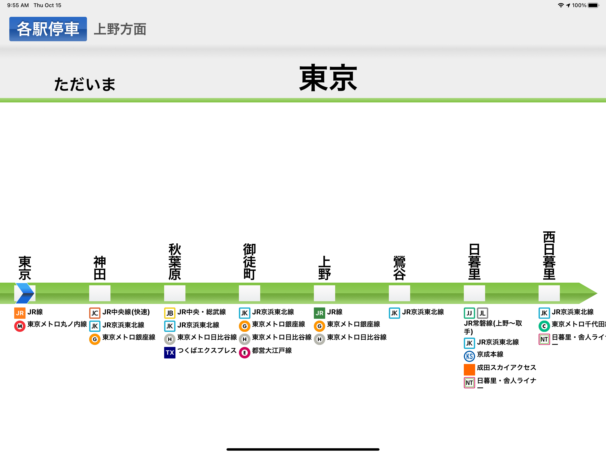
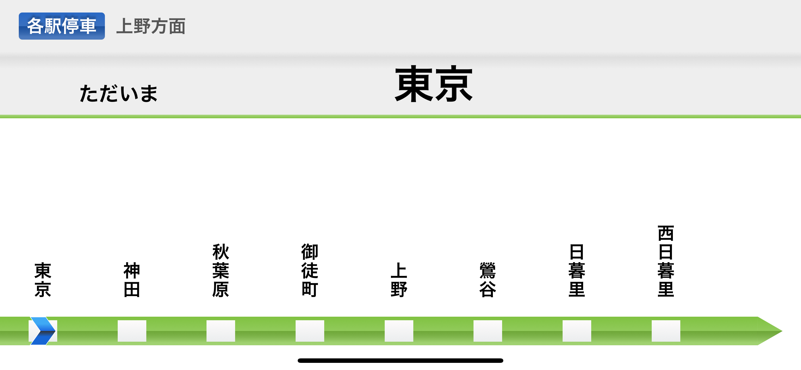
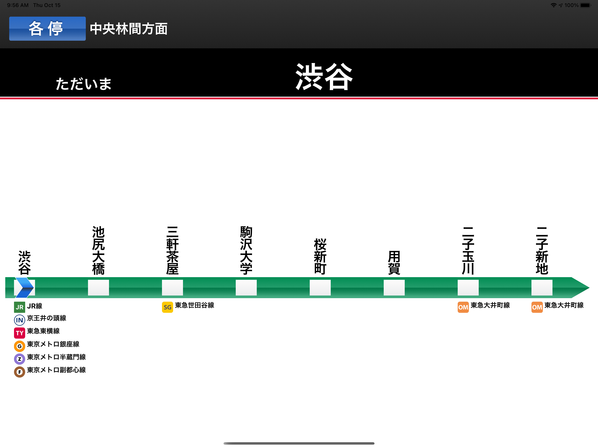
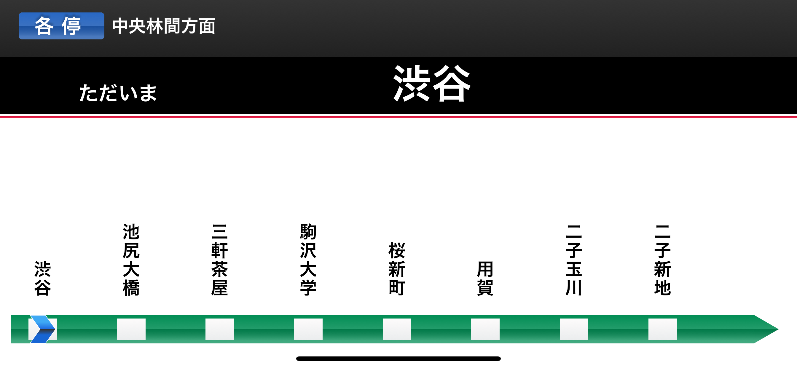

# TrainLCD

<!-- ALL-CONTRIBUTORS-BADGE:START - Do not remove or modify this section -->

<!-- ALL-CONTRIBUTORS-BADGE:END -->

**The LCD of trains in major cities in Japan is reproduced in conjunction with the current location.**

## Contributors ✨

Thanks goes to these wonderful people ([emoji key](https://allcontributors.org/docs/en/emoji-key)):

<!-- ALL-CONTRIBUTORS-LIST:START - Do not remove or modify this section -->
<!-- prettier-ignore-start -->
<!-- markdownlint-disable -->
<table>
  <tr>
    <td align="center"><a href="https://github.com/makotia"> <b>makotia</b></a> <a href="https://github.com/TrainLCD/MobileApp/commits?author=makotia" title="Documentation">📖</a> <a href="#userTesting-makotia" title="User Testing">📓</a> <a href="https://github.com/TrainLCD/MobileApp/pulls?q=is%3Apr+reviewed-by%3Amakotia" title="Reviewed Pull Requests">👀</a></td>
    <td align="center"><a href="https://sw-saturn.dev"> <b>Kanta Demizu</b></a> <a href="#data-Sw-Saturn" title="Data">🔣</a> <a href="#userTesting-Sw-Saturn" title="User Testing">📓</a> <a href="https://github.com/TrainLCD/MobileApp/pulls?q=is%3Apr+reviewed-by%3ASw-Saturn" title="Reviewed Pull Requests">👀</a></td>
    <td align="center"><a href="https://neiro.work"> <b>Neiro Somemiya</b></a> <a href="#userTesting-nirsmmy" title="User Testing">📓</a> <a href="#data-nirsmmy" title="Data">🔣</a></td>
    <td align="center"><a href="https://github.com/kokoa0429"> <b>yasuto masuda</b></a> <a href="#userTesting-kokoa0429" title="User Testing">📓</a></td>
    <td align="center"><a href="https://kataba.me"> <b>Katabame Miaya</b></a> <a href="#data-katabame" title="Data">🔣</a> <a href="#userTesting-katabame" title="User Testing">📓</a></td>
  </tr>
</table>

<!-- markdownlint-restore -->
<!-- prettier-ignore-end -->

<!-- ALL-CONTRIBUTORS-LIST:END -->

This project follows the [all-contributors](https://github.com/all-contributors/all-contributors) specification. Contributions of any kind welcome!

## Features

- Reproduce the LCD of the train in conjunction with the location information
- Notify you when you approach the arrival station or arrive
- Tired of design? Let's use the LCD of various routes with the theme you can choose!

## Screenshots

**...Also, FULL ENGLISH SUPPORT!!**

## Download

## Join our community(Japanese only)

Do you like this project? Join our Discord community!
[https://discord.gg/7sQhQhnvvw](https://discord.gg/7sQhQhnvvw)

## Related project

[StationAPI](https://github.com/TinyKitten/StationAPI)
