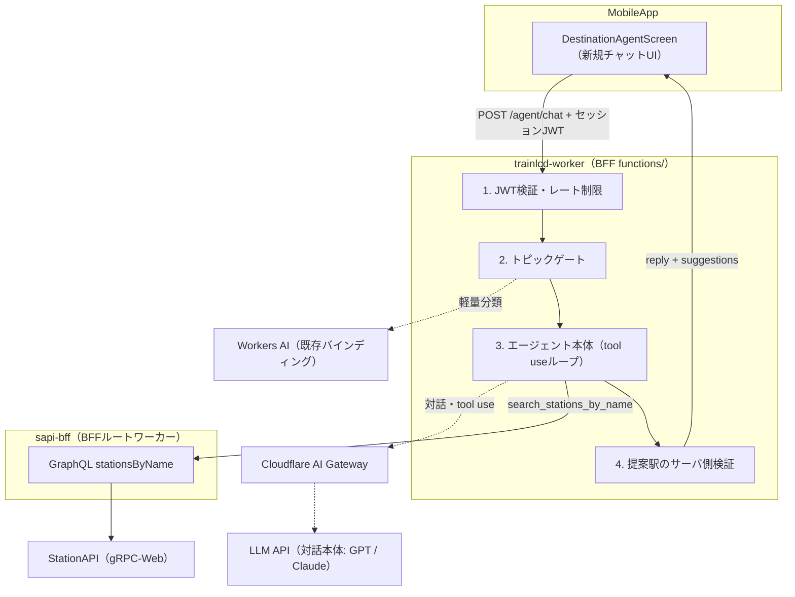
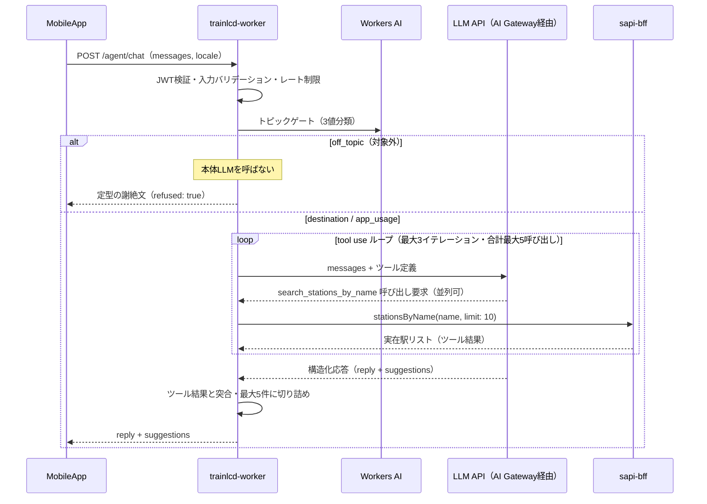

# AIエージェント設計書

- 対応 Issue: [#6474 [AI PoC] 設計](https://github.com/TrainLCD/MobileApp/issues/6474)
- 親 Issue（要件定義）:
  [#6473 AIエージェントの開発](https://github.com/TrainLCD/MobileApp/issues/6473)
- ステータス: ドラフト（PoC 向け）

## TL;DR

独自の AI エージェントとユーザが自然言語で対話し、「海が見える駅に行きたい」の
ような曖昧な要望から実在する駅を最大 5 件提案して、既存の行き先決定フロー
（`SelectBoundModal` → `selectedBound` 確定）に接続する。LLM 呼び出しは
BFF（`TrainLCD/BFF` の `functions/` = trainlcd-worker）に新設する
`POST /agent/chat` に集約し、アプリは既存のセッション JWT + callable 互換
ワイヤ形式で fetch するだけにする。駅名の実在性は LLM の tool use から
BFF ルートワーカー（sapi-bff）の GraphQL `stationsByName` を呼んで担保し、
サーバ側でも「ツール結果に含まれない駅の提案は破棄する」検証を行い、
嘘をつけない構造にする。トピック外プロンプトは本体 LLM の手前の軽量ゲートで
謝絶しトークンを守る。

## Context

- TrainLCD の行き先決定は現在 2 系統ある。路線から選ぶ `SelectLineScreen`
  と、駅名で検索する `RouteSearchScreen`（`stationsByName` による
  あいまい検索）である。どちらも「駅名を知っている」ことが前提で、
  駅名を知らない・思い出せないユーザは行き先を決められない。
- 親 Issue #6473 は「駅名を知らなくても連想できる言葉で行き先を決定できる」
  体験を要件として定義している。
- バックエンドはすでに Cloudflare Workers に全面移行済み（Firebase 全廃）。
  LLM 推論の前例として trainlcd-worker のフィードバックトリアージ
  （Workers AI）がある。
- 本書は PoC（実証）フェーズの設計であり、判断が必要な項目は末尾
  「未決事項」に集約する。

## 要件整理

### MUST（#6473 より）

1. AI エージェントはユーザと自然言語で対話できる。
2. 曖昧な目的地を受け取り、選択可能な駅を最大 5 件程度提案する。
3. 提案前に StationAPI へ実在性を問い合わせ、実在しない駅名は提案しない。
4. 合致する駅が存在しない場合は正直に「見つからない」と伝える
   （ハルシネーションの防止）。
5. TrainLCD のアプリ動作と無関係なプロンプトはすべて謝絶する
   （トークン浪費の防止）。ただしアプリの使い方など TrainLCD に関する
   質問には回答できる。

### WANT（#6473 より）

- 始発駅〜行き先の自然言語での経路検索。サーバ負荷・AI 使用料を加味して
  要検討（本書では将来設計スケッチのみ）。

### 非機能要件

- PoC の LLM モデルは GPT もしくは Claude を検討し、合理的な価格帯と
  返答の精度で吟味する（#6473 非機能要件。吟味方法は「モデル選定」参照）。
- AI エージェントフレームワークは使用する価値があれば適宜使用する
  （#6473 非機能要件。検討は「エージェントフレームワーク」参照）。
- LangChain / LangSmith を使用して作成したエージェントの妥当性を検証
  する（#6473 非機能要件。方法は「テスト戦略」の妥当性検証の項参照）。
- コスト管理: 会話履歴の上限、入出力トークン上限、事前ゲートによる謝絶、
  レート制限。
- 不正利用対策: セッション JWT 必須、installId 単位のレート制限、
  入力長制限。
- 可用性・安全停止: Remote Config によるキルスイッチ
  （既存 `tts_enabled` と同パターン）。
- プライバシー: 会話本文は既定で永続化しない（未決事項参照）。
- 多言語: 端末ロケール（ja / en）に応じた応答言語。

## 全体アーキテクチャ

LLM 呼び出しは必ずサーバ側（BFF）に置く。理由は次の 3 点。

1. API キーをクライアントに配布しない。
2. レート制限・トピックゲート・実在性検証をサーバで強制でき、
   改造クライアントでも突破できない。
3. モデル・プロンプトの差し替えをアプリリリース無しで行える。



構成要素と責務:

| 構成要素 | 置き場所 | 責務 |
| --- | --- | --- |
| チャット画面 | MobileApp（新規） | 対話 UI・提案カード・既存フロー接続 |
| エージェント API | trainlcd-worker | 認証・ゲート・LLM 呼び出し・検証 |
| LLM 経路 | AI Gateway | ログ・コスト集計・レート制限・キャッシュ |
| 駅名検索ツール | sapi-bff `/graphql` | `stationsByName` で実在性確認 |
| フラグ配信 | `/config/remote` | `ai_agent_enabled` キルスイッチ |

sapi-bff への接続は同一 Cloudflare アカウント内なので Service Binding を
推奨する（ネットワーク往復なし・認証不要で worker 間呼び出しできる）。
バインディングが難しい場合は既存 GraphQL エンドポイントへの fetch でも
成立する。

## 対話 API 設計（trainlcd-worker）

### エンドポイント

`POST /agent/chat`。ワイヤ形式は既存エンドポイントと同じ
Firebase callable 互換（`{ data: {...} }` → `{ result: {...} }`）とし、
`src/lib/workerApi.ts` + `src/lib/session.ts` の既存実装をそのまま
流用できるようにする。

リクエスト:

```json
{
  "data": {
    "messages": [
      { "role": "user", "content": "海が見える駅に行きたい" }
    ],
    "locale": "ja",
    "currentStationGroupId": 1130205
  }
}
```

- `messages`: クライアント保持の会話履歴（後述）。最大 12 メッセージ・
  1 メッセージ最大 500 文字をサーバ側で強制。
- `locale`: `ja` | `en`。応答言語の指示に使う。
- `currentStationGroupId`: 任意。現在駅があれば `stationsByName` の
  `fromStationGroupId` に渡し、現在地に近い候補を優先させる。

レスポンス:

```json
{
  "result": {
    "reply": "海の見える駅でしたら、こちらはいかがでしょうか。",
    "suggestions": [
      {
        "stationId": 1130205,
        "stationGroupId": 1130205,
        "name": "鎌倉",
        "nameRoman": "Kamakura",
        "lineNames": ["JR横須賀線"]
      }
    ],
    "refused": false
  }
}
```

- `reply`: ユーザに表示する応答文。
- `suggestions`: 提案駅（0〜5 件）。空配列は「合致なし」または
  「駅提案が不要な応答（使い方の質問への回答など）」を意味する。
- `refused`: トピックゲートで謝絶した場合 `true`。クライアントは
  定型文を表示するだけでよい。

### 会話状態管理

サーバはステートレスとする（KV へのセッション保存はしない）。会話履歴は
クライアントが画面ローカル state で保持し、毎回全量（上限 12 メッセージ）
を送る。上限超過時はクライアントが古いものから捨てる。行き先を 1 つ
決めるための短い対話が想定ユースケースなので、この上限で十分であり、
サーバ側の状態管理と TTL 設計を丸ごと省略できる。

### ストリーミング

PoC では非ストリーミングとする。アプリに SSE の前例がなく、想定する応答は
短い（後述の `max_tokens` 制限）ため、体感遅延はローディング表示で許容範囲
に収まる見込み。将来ストリーミングが必要になった場合は、Expo SDK 52+ の
`expo/fetch`（ストリーミング対応 fetch）+ SSE で設計し直す
（未決事項に記載）。

## エージェント本体設計（BFF 側）

### 処理パイプライン

1 ターンの処理は次のシーケンスで行う。



### トピックゲート（MUST 要件 5）

「無関係なプロンプトの謝絶」を本体 LLM のシステムプロンプト任せにせず、
手前に安価な分類ステップを置く。謝絶されるリクエストが本体モデルの
トークンを 1 つも消費しないことが目的。

- 実装: 既存の Workers AI バインディング（`env.AI`、フィードバック
  トリアージで使用実績あり）で軽量モデルに 3 値分類させる。
  - `destination`: 行き先・駅・移動に関する相談 → 本体へ
  - `app_usage`: TrainLCD の使い方に関する質問 → 本体へ
  - `off_topic`: それ以外 → 定型の謝絶文を返して終了
- 判定に迷うケースは `destination` に倒す（false negative で
  ユーザ体験を壊さない）。
- 本体側のシステムプロンプトにも同じスコープ制約を二重に入れる
  （ゲートすり抜け対策）。

### モデル選定（対話本体）

親 Issue #6473 の非機能要件に従い、GPT（OpenAI）もしくは
Claude（Anthropic）を候補とし、価格と精度で吟味する。定性比較:

| 観点 | OpenAI GPT | Anthropic Claude |
| --- | --- | --- |
| function calling | ○ | ○（strict tool use で入力保証） |
| 構造化出力 | ○ | ○（`output_config.format`） |
| 日本語品質 | 高い | 高い |
| プロンプトキャッシュ | ○ | ○（後述の設計で活用） |

どちらでも本書のガードレール設計（tool use・構造化出力・サーバ側検証）は
成立する。どちらも未検証の現段階では既定を置かず、採用は後述の
吟味の結果で決める。Claude 側の候補は次の 2 モデル:

| モデル | 入力 $/1M tok | 出力 $/1M tok | 位置づけ |
| --- | --- | --- | --- |
| `claude-opus-5` | $5.00 | $25.00 | 品質優先候補（フラッグシップ） |
| `claude-haiku-4-5` | $1.00 | $5.00 | コスト優先候補（1/5 の価格） |

GPT 側の候補は次の 2 モデル（2026-07 時点のラインナップ）:

| モデル | 位置づけ |
| --- | --- |
| GPT-5.6 Sol | 品質優先候補（フラッグシップ） |
| GPT-5.6 Luna | コスト優先候補（小型ティア） |

GPT 側の料金は改定が頻繁なため本書には記載せず、吟味時に公式料金表で
確認して同条件で比較する。モデル名も世代交代が早いため、吟味時点で
最新世代の同ティアに読み替える。

吟味方法（PoC 内で実施）:

1. 評価セットを用意し、LangSmith の Dataset として管理する
   （曖昧な要望 20 件・存在しない駅 5 件・使い方質問 5 件・
   無関係な話題 10 件程度）。
2. プロンプトとツール定義をプロバイダ非依存に保ち、同一評価セットを
   Claude 候補 2 モデルと GPT 候補 2 モデル（上表）に流す。
3. 提案の妥当性（人手評価）・実在性検証の通過率・謝絶精度・
   1 ターンあたり実測コスト・レイテンシで比較し、採用モデルを決める。
   実行結果は LangSmith の Experiment として記録して比較する
   （「テスト戦略」の妥当性検証の項参照）。
4. モデル名は Worker の vars で切り替え可能にしておき、採用後も
   再評価・差し替えを容易にする。

### ツール定義

ツールは 1 本のみ。プロトコル（名前・入力・出力）はプロバイダ非依存の
JSON Schema として定義し、プロバイダ別アダプターで各形式に変換する。
Anthropic では `input_schema` + `strict: true`、OpenAI では function
calling の `parameters` + `strict: true` に同一スキーマを割り当てる
（Vercel AI SDK を採用する場合、この変換は SDK のツール定義が担う）。
以下は Anthropic 形式での定義例:

```json
{
  "name": "search_stations_by_name",
  "description": "駅名や読みの一部から実在する駅を検索する。ユーザに駅を提案する前に必ず実在確認に使うこと。",
  "strict": true,
  "input_schema": {
    "type": "object",
    "properties": {
      "name": { "type": "string", "description": "検索する駅名（部分一致可）" }
    },
    "required": ["name"],
    "additionalProperties": false
  }
}
```

- 実装: sapi-bff の
  `stationsByName(name, limit: 10, fromStationGroupId: <現在駅>)` を呼び、
  `stationId` / `stationGroupId` / `name` / `nameRoman` / `lineNames` に
  絞った軽量 JSON を返す（`StationFields` 全量を返すとツール結果で
  トークンを浪費する）。フィールド名は応答スキーマと同一に統一し、
  `StationFields` の `groupId` は BFF 内で `stationGroupId` に改名して
  詰め替える。
- 並列ツール呼び出しを許可する。モデルは 1 イテレーション内で複数の
  候補名を同時に検索してよい。
- ループ上限: イテレーション最大 3 回・1 ターン合計のツール呼び出し
  最大 5 回。超過時はその時点の結果で応答を生成させる。

### 応答の構造化と実在性保証（MUST 要件 3・4）

最終応答は構造化出力（JSON Schema 強制）で次の形にする:

```json
{
  "reply": "string",
  "suggestions": [
    {
      "stationId": 0,
      "stationGroupId": 0,
      "name": "",
      "nameRoman": "",
      "lineNames": [""]
    }
  ]
}
```

その上で、モデル出力を信用せずサーバ側で検証する:

1. `suggestions` の各要素を、このターンで実行したツール結果
   （実在確認済み駅の集合）と `stationId` で突合し、含まれないものは
   破棄する。
2. 5 件を超える場合は先頭 5 件に切り詰める。
3. ツール結果が全ターンで 0 件だった場合、`suggestions` は必ず空配列に
   する。システムプロンプトでも「見つからなかったと正直に伝える」よう
   指示するが、最終保証はこの検証が担う。

この二段構えにより「LLM がハルシネーションで駅をでっち上げる」経路を
構造的に塞ぐ。

### アプリ使い方 QA（MUST 要件 5 の後半）

使い方 FAQ をシステムプロンプトに同梱する。フィードバックトリアージの
few-shot（`CONFIG_KV` の `config:fewshot`）と同じパターンで、`CONFIG_KV`
の `config:agent-faq` に Markdown を置いて Worker 起動時に読み込む。
アプリリリースなしで FAQ を更新できる。FAQ に無い質問には
「答えられない」と正直に返すよう指示する。

### プロンプトキャッシュ

システムプロンプト（スコープ制約 + FAQ + 出力規約）とツール定義は
全リクエストで不変なので、システムプロンプト末尾にキャッシュ境界
（Claude なら `cache_control: {"type": "ephemeral"}`）を置いて
プロンプトキャッシュを効かせる。会話履歴・locale・現在駅などの可変要素は
必ずキャッシュ境界より後（messages 側）に置く。`claude-opus-5` の最小
キャッシュ対象は 512 トークンなので FAQ 込みのシステムプロンプトなら
容易に超える（`claude-haiku-4-5` は最小 4096 トークンでキャッシュが
効かない可能性がある点に注意）。

### レート制限・トークン上限

| 項目 | 値（PoC 初期値） |
| --- | --- |
| 1 ユーザあたり | 30 ターン/日 |
| 入力メッセージ | 最大 12 件・各 500 文字 |
| 出力 | `max_tokens: 1024` |
| ツール呼び出し | 5 回/ターン |

- 日次上限は KV に `agent-rl:<installId>:<yyyymmdd>` のカウンタ
  （TTL 25 時間）で実装する。KV の結果整合で厳密さは劣るが PoC には
  十分。厳密なレート制限が必要になったら Durable Objects へ移行する。
- 上限到達時は 429 と定型メッセージを返し、クライアントはそれを
  表示する。

### タイムアウト・キャンセル・再試行

| 呼び出し | 期限（PoC 初期値） |
| --- | --- |
| リクエスト全体（Worker 側） | 25 秒 |
| LLM API 1 呼び出し | 15 秒 |
| sapi-bff（ツール実行） | 5 秒 |

- Worker はリクエスト全体の期限を `AbortController` で管理し、期限超過時
  は下流の LLM・sapi-bff 呼び出しへキャンセルを伝播して 504 を返す。
- LLM 呼び出しはコスト重複を避けるため自動再試行しない。sapi-bff への
  ツール実行のみ読み取り専用で冪等のため 1 回だけ再試行を許す。
- クライアントのタイムアウト（30 秒）はサーバ全体期限より長く取り、
  「サーバが先に諦めて確定応答を返す」関係を保つ。タイムアウト後の再送
  は新規ターンとして扱い、以前の処理結果を引き継がない。

## 技術選定

実装に入る前に確定させる、ライブラリの採用・不採用の候補一覧。
本節の判定は実装開始前のレビューで確定する。方針は「BFF の lean な
依存構成（現状 `dayjs` + `jsonc-parser` のみ）を崩さず、新規依存を
最小セットに絞る」こと。

### エージェントフレームワーク

親 Issue #6473 の非機能要件「使用する価値があれば適宜使用する」に
対する検討。今回のエージェントは「ツール 1 本 + 短いループ + 構造化
応答」という小さな構成なので、重量級のオーケストレーションは不要で、
プロバイダ抽象化の価値が最も大きい。

- 推奨: Vercel AI SDK（`ai`）を薄い抽象化層として採用する。
  理由は次の 3 点。
  1. GPT / Claude を同一コードで吟味でき、モデル選定の比較評価と
     採用後の差し替えがモデル指定の変更だけで済む。
  2. tool use ループ・構造化出力・`AbortSignal` によるタイムアウト
     伝播を標準サポートし、本書の設計をそのまま実装に落とせる。
  3. Cloudflare Workers での動作実績がある。
- 採用条件: バンドルサイズと Workers 互換性を PoC 初期に確認し、
  問題があれば公式 SDK の直接利用へフォールバックする
  （エージェントループが小さいため乗り換えコストは低い）。

LangChain をエージェント実行基盤として使わない理由:

1. 本 PoC で使う機能は「ツール付き LLM 呼び出しのループ」のみで、
   LangChain が本領を発揮する部品（チェーン・メモリ管理・RAG・
   マルチエージェント連携）をひとつも使わない。
2. 使わない部品のために厚い抽象化層を挟むと、デバッグ時に追う層と
   Workers のバンドルサイズが増え、対価として得るものがない。
   Vercel AI SDK は必要な機能（プロバイダ切替・ツールループ・
   構造化出力）でちょうど止まる薄さであり、コードレビューでも
   処理を追いやすい。
3. 妥当性検証の非機能要件は LangChain ランタイム無しでも LangSmith
   単体で満たせる（「テスト戦略」の妥当性検証の項参照）。
4. 将来 WANT 要件（経路検索）や複雑な対話でチェーン・メモリ管理を
   自作し始めたら、その時点で LangChain / Mastra 等を再検討する。
   エージェントループが小さいうちは乗り換えコストも小さい。

### ライブラリ候補（BFF: trainlcd-worker）

| 関心事 | 判定 | 候補 | 理由 |
| --- | --- | --- | --- |
| LLM 抽象化 | 採用 | `ai`（Vercel AI SDK） | 前節のとおり |
| プロバイダ | 採用 | `@ai-sdk/anthropic` / `@ai-sdk/openai` | 吟味に両対応 |
| LLM 経路 | 採用 | Cloudflare AI Gateway | ログ・コスト・制限を CF に集約 |
| スキーマ検証 | 採用 | `zod` | ツール定義・構造化出力・入力検証を一元化 |
| エージェント基盤 | 不採用 | LangChain / Mastra / LlamaIndex | 実行基盤には過剰 |
| 妥当性検証 | 採用 | LangSmith（`langsmith`） | トレース収集と評価実験の管理 |
| 公式 LLM SDK | 保留 | `@anthropic-ai/sdk` / `openai` | AI SDK 不適時の代替 |
| ルーティング | 不採用 | Hono / itty-router | 既存の素の fetch 分岐を踏襲 |
| GraphQL | 不採用 | graphql-request 等 | Service Binding + fetch で十分 |
| レート制限 | 自前 | （KV カウンタ） | ライブラリ不要 |
| 再試行・期限 | 自前 | p-retry 等は不使用 | `AbortController` + 1 回再試行のみ |
| トピックゲート | 既存 | Workers AI（`env.AI`） | 追加依存なし・使用実績あり |

補足:

- Vercel AI SDK は Worker 内で動くライブラリであり、Vercel の
  ホスティングには依存しない（名前は開発元に由来するだけで、
  Cloudflare Workers 上で問題なく動作する）。
- LLM API の呼び出しは Cloudflare AI Gateway を経由させる。
  リクエストログ・コスト集計・キャッシュ・レート制限・プロバイダ
  フォールバックを Cloudflare 側に集約でき、AI SDK からは接続先
  URL を Gateway に向けるだけで済む。
- Workers AI を対話本体に使わない理由: GPT / Claude は Workers AI
  上では動かず、#6473 の非機能要件（GPT もしくは Claude）と両立
  しない。また対話本体は「日本語対話 + ツール呼び出し + スキーマ
  厳守」の複合タスクで、オープンウェイト小型モデルでは安定性が
  要件に届かないリスクが高い。単純な 1 回分類であるトピックゲート
  には引き続き Workers AI を使う（トリアージと同じ適材適所）。

### ライブラリ候補（アプリ: MobileApp）

新規依存の追加はゼロとする。

| 関心事 | 判定 | 候補 | 理由 |
| --- | --- | --- | --- |
| チャット UI | 不採用 | react-native-gifted-chat 等 | 既存部品と適合しない |
| サーバ通信 | 既存 | fetch（`workerApi` / `session` 流用） | 新規依存なし |
| 状態管理 | 既存 | React `useReducer` | 新規ライブラリ・atom 不要 |
| 多言語 | 既存 | i18n-js（既存機構） | 新規依存なし |

チャット UI は `FlashList` + `CommonCard` + 既存モーダル・トーストの
組み合わせで自前実装する（LED テーマ対応と見た目の統一のため）。

## コスト試算

前提: 1 ターン = ゲート 1 回 + 本体 LLM 呼び出し 2 回
（ツールループ 1 往復。並列呼び出しが増えた場合はツール結果の分だけ
入力トークンが増える）。入力はシステムプロンプト約 2,000 tok
（2 回目以降キャッシュ読み取り）+ 履歴・ツール結果約 3,000 tok、
出力約 400 tok。

| 項目 | `claude-opus-5` | `claude-haiku-4-5` |
| --- | --- | --- |
| 1 ターン概算 | 約 $0.04〜0.06 | 約 $0.008〜0.012 |
| 1,000 ターン/日 | 約 $40〜60/日 | 約 $8〜12/日 |
| 謝絶リクエスト | ほぼ $0 | ほぼ $0 |

補足:

- トピックゲートにより無関係リクエストのコストはほぼゼロに抑えられる
  （MUST 要件 5 の狙いどおり）。
- レート制限（30 ターン/日/人）が総量の天井になる。
- GPT 候補の試算は吟味時の公式料金で同条件計算する。
- 為替・キャッシュヒット率で変動するため、PoC 中に
  Workers Analytics Engine で実測する。

## クライアント設計（MobileApp 側）

### 画面とナビゲーション

- 新規画面 `src/screens/DestinationAgentScreen.tsx` を追加し、
  `src/stacks/MainStack.tsx` に `<Stack.Screen name="DestinationAgent" />`
  として登録する（既存画面の登録手順に従う）。
- エントリポイントは `RouteSearchScreen` に置く「AI に相談」ボタン
  （フィーチャーフラグで表示制御）。行き先を探す文脈に自然に接続する
  ため。
- UI 構成: メッセージリスト（`FlashList`、`RouteSearchScreen` と同様）+
  入力バー + 送信ボタン。提案駅は既存 `CommonCard` を流用したタップ可能な
  カードとしてアシスタントメッセージ内に描画する。ローディングは既存の
  インジケータ、エラーは `GlobalToast` を使う。LED テーマ配色は
  `NewReportModal` の実装に倣う。

### 状態管理

会話履歴・入力中テキスト・ローディング状態はすべて画面ローカル
（`useReducer`）で持つ。高頻度更新の共有状態ではないため Jotai atom は
追加しない（`docs/state-management.md` の方針に適合）。画面を離れたら
履歴は破棄してよい（PoC）。

### API 呼び出し

`src/lib/workerApi.ts` の `workerUrl('/agent/chat')` と
`src/lib/session.ts` の `getSessionToken()` を流用し、`useFeedback` と
同じ fetch パターンで実装する（新規フック
`src/hooks/useDestinationAgent.ts`）。タイムアウトは 30 秒。

### 提案駅選択 → 既存フローへの接続

提案カードタップ後は `RouteSearchScreen` の検索結果タップと完全に同じ
挙動に合流させる:

1. エージェントの `suggestions` は軽量情報（stationId 等）しか持たない
   ため、`GET_STATIONS_BY_IDS`（`stations(ids:)`）で `StationFields`
   完全な `Station` を再取得する。
2. `RouteSearchScreen.tsx` の `handleLineSelected` 相当のロジック
   （`GET_ROUTE_TYPES_LIGHT` → 種別選択 → `pendingStations` 構築）を
   共有フック（例: `src/hooks/useDestinationSelection.ts`）に抽出し、
   `RouteSearchScreen` と `DestinationAgentScreen` の両方から使う。
3. `SelectBoundModal` で方向を確定し `selectedBound` がセットされたら
   `Main` へ遷移（既存挙動のまま）。

既存フローに再合流することで、種別・方向・区間の整合性ロジックを一切
複製しない。

### フィーチャーフラグとキルスイッチ

`src/lib/remoteConfig.ts` の既存パターンを踏襲する:

1. Worker 側 `/config/remote` に `ai_agent_enabled`（既定 `false`）を
   追加。
2. アプリ側は `REMOTE_CONFIG_KEYS` にキー追加 → フォールバック定数
   （`false`）→ ゲッター → `useAIAgentFeatureEnabled` フック。
3. PoC 期間中はさらに `isDevApp`（dev/canary ビルド）でもゲートし、
   本番ビルドには一切露出しない。
4. 障害・コスト超過時は KV の値を `false` にするだけで全クライアントから
   機能が消える（`FxTTS` と同じキルスイッチ構造）。

### 多言語対応

- UI 文言は `assets/translations/ja.json` / `en.json` にキー追加、
  `translate()` で参照。
- エージェント応答言語はリクエストの `locale` で指示
  （`isJapanese` から導出）。
- 駅名表示は既存慣例どおり `isJapanese ? name : nameRoman`。

### エラーハンドリング

| 状況 | クライアント挙動 |
| --- | --- |
| 429（レート制限） | 「本日の利用上限に達しました」を表示 |
| `refused: true` | サーバの定型謝絶文をそのまま表示 |
| ネットワーク/5xx | `GlobalToast` 表示 + 入力を復元し再送可能に |
| フラグ off | エントリボタン自体を非表示 |

## セキュリティ・プライバシー

- 認証: セッション JWT 必須。未認証は 401。
- プロンプトインジェクション: ユーザ入力はすべて untrusted として
  システムプロンプトでスコープを固定。ツールは読み取り専用の駅検索
  1 本のみで、注入が成立しても被害面が存在しない。
- 入力制限: メッセージ長・件数制限で巨大入力によるコスト攻撃を防ぐ。
- ログ: 会話本文は既定で永続化しない。メトリクス（ターン数・謝絶率・
  提案採択率・トークン使用量）のみ Workers Analytics Engine に記録する。
  品質改善のための本文サンプリング保存を行うかはプライバシーポリシー
  改定を含めてオーナー判断（未決事項）。
- LLM プロバイダ側のデータ保持: 会話本文は採用プロバイダ
  （OpenAI / Anthropic）へ送信されるため、自社側の非永続化とは別に、
  次を実装開始前の必須条件とする。
  - プロバイダの API データ利用ポリシー（学習への不使用・保持期間・
    処理リージョン・削除手段）を確認し、保持を最小化できる設定や
    契約オプションの適用可否を決定する。
  - 確認結果に基づき、プライバシーポリシーへの明記と追加のユーザ同意
    の要否を判断する。確認・適用の完了はオーナーが承認する。
- 妥当性検証のトレース: LangSmith へのトレース送信（会話本文を含む）
  は dev 環境のみで行い、本番では無効にする（「テスト戦略」参照）。
- AI Gateway のログ: 既定ではメタデータのみを記録し、プロンプト・
  応答本文のログ保存は無効化する（有効化する場合は dev 環境に限定し、
  会話ログの保存方針の判断に従う）。
- シークレット: LLM API キーと LangSmith API キーを wrangler secret
  として追加（`.secrets.env.example` にも追記）。

## WANT: 自然言語経路検索（将来スケッチ）

sapi-bff には既に `routes` / `connectedRoutes` クエリ
（`GetRoutesMinimal` / `GetConnectedRoutes` RPC）があるため、技術的には
次の拡張で成立する:

1. ツール `search_routes(fromStationGroupId, toStationGroupId)` を追加。
2. エージェントが出発・到着それぞれを `search_stations_by_name` で
   解決してから経路を引く。
3. 応答スキーマに経路候補（プリセット経路 `SavedRoute` 互換の形）を
   追加し、タップで `handlePresetPress` 相当に接続する。

ただし 1 ターンあたりのツール往復とトークン量が倍増し、StationAPI への
負荷も増えるため、PoC の実測データ（コスト・レイテンシ・利用率）が
出てから判断する。本 PoC ではスキーマに拡張余地（`suggestions` と並ぶ
`routes` フィールドの予約）だけ残す。

## テスト戦略

| 対象 | 方法 |
| --- | --- |
| BFF: バリデーション・提案検証 | 純関数に切り出して Jest |
| BFF: エージェントループ | LLM クライアントをモックして Jest |
| BFF: 結合 | `wrangler dev` + 手動シナリオ |
| アプリ: フック | `jest.mock` で fetch をモック |
| アプリ: UI | dev ビルドで手動 QA + スクリーンショット |

- エージェントループのテストでは、ツール結果突合・件数切り詰め・
  空結果時の挙動を重点的に検証する。
- 手動シナリオは吟味用の評価セット（曖昧な要望 / 存在しない駅 /
  無関係な話題 / 使い方質問）を流用する。
- アプリ側は既存の `src/utils/test/` ヘルパーを流用し、提案タップ →
  `SelectBoundModal` → Main 遷移までを QA する。

### LangSmith によるエージェント妥当性検証

親 Issue #6473 の非機能要件に従い、エージェントの応答品質は
LangChain 社の LangSmith で検証する。エージェントの実行基盤には
LangChain を使わず、検証プラットフォームとして LangSmith を使う
役割分担とする（「技術選定」参照）。

- トレーシング: Vercel AI SDK の呼び出しを LangSmith のトレース連携で
  記録し、ツール呼び出し・トークン使用量・レイテンシをターン単位で
  可視化する。トレース送信は dev 環境のみ有効化し、本番では無効にする
  （会話本文が LangSmith へ送信されるため。
  「セキュリティ・プライバシー」参照）。
- 評価: モデル吟味の評価セットを LangSmith の Dataset として登録し、
  モデル・プロンプトの組み合わせごとに Experiment を実行して
  提案妥当性・謝絶精度・実在性検証の通過率を比較する。
- 回帰検証: プロンプトやモデルを変更する際は同じ Dataset で
  Experiment を再実行し、指標が劣化していないことを確認してから
  反映する。

## 段階的リリース計画

| フェーズ | 対象 | 内容 |
| --- | --- | --- |
| Phase 0（PoC） | dev ビルド | 本設計の実装 + モデル吟味 + 実測 |
| Phase 1 | canary | プロンプト調整後に開放し指標評価 |
| Phase 2 | production | フラグ本番化・`isDevApp` ゲート除去 |

- Phase 0 では `ai_agent_enabled` を dev 環境 KV のみ `true` にする。
- Phase 1 の評価指標はコスト・謝絶率・提案採択率。
- Phase 2 で WANT 要件（経路検索）の着手可否を判断する。

## 開発プロセス（#6473 実装備考より）

- 設計タスク（本書）は Claude Fable 5 を使用する。
- 実装そのものは Claude Opus 5 を使用する。
- コードレビューは CodeRabbit を使用し、CodeRabbit でのレビュー通過後は
  @TinyKitten が目視確認する。

## 変更ファイル一覧（想定）

### TrainLCD/BFF（functions/ = trainlcd-worker）

| ファイル | 内容 |
| --- | --- |
| `functions/src/agent/handler.ts`（新規） | `/agent/chat` ハンドラ |
| `functions/src/agent/gate.ts`（新規） | Workers AI トピックゲート |
| `functions/src/agent/tools.ts`（新規） | 駅検索ツール（sapi-bff 呼び出し） |
| `functions/src/agent/validate.ts`（新規） | 提案駅突合・切り詰め（純関数） |
| `functions/wrangler.jsonc` | ルート・Service Binding・AI Gateway・vars |
| `functions/package.json` | `ai`・`@ai-sdk/*`・`zod`・`langsmith` 追加 |
| `functions/.secrets.env.example` | LLM・LangSmith の API キー追記 |

設定 KV には `config:remote` への `ai_agent_enabled` 追加と、
`config:agent-faq` の新設を行う。

### TrainLCD/MobileApp

| ファイル | 内容 |
| --- | --- |
| `src/screens/DestinationAgentScreen.tsx`（新規） | チャット画面 |
| `src/hooks/useDestinationAgent.ts`（新規） | `/agent/chat` 呼び出し |
| `src/hooks/useDestinationSelection.ts`（新規） | 共有選択ロジック |
| `src/hooks/useAIAgentFeatureEnabled.ts`（新規） | フラグフック |
| `src/screens/RouteSearchScreen.tsx` | 共有フック化 + エントリボタン |
| `src/stacks/MainStack.tsx` | 画面登録 |
| `src/lib/remoteConfig.ts` | `ai_agent_enabled` キー追加 |
| `assets/translations/ja.json` / `en.json` | UI 文言追加 |

## 未決事項（オーナー判断が必要）

1. **対話本体のモデル**: 吟味の初期比較対象として
   `claude-opus-5` / `claude-haiku-4-5` / GPT 候補のどれから始めるか。
   評価後の最終採用もオーナー判断。
2. **会話ログの保存方針**: 品質改善のためのサンプリング保存を行うか。
   行う場合はプライバシーポリシーへの明記が必要。
3. **レート制限の初期値**: 30 ターン/日/人 で妥当か。
4. **エントリポイントの位置**: `RouteSearchScreen` 内ボタン案で良いか
   （`SelectLineScreen` 起点の案もあり得る）。
5. **ストリーミング**: PoC 非対応の方針で良いか。体感が悪ければ
   `expo/fetch` + SSE を Phase 1 で検討。
