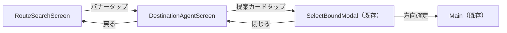

# AIエージェント UI設計書

- 対応 Issue: [#6477 [AI PoC] UI設計](https://github.com/TrainLCD/MobileApp/issues/6477)
- アーキテクチャ設計書: [architecture.md](./architecture.md)（#6474 / #6476 で FIX 済み）
- ステータス: ドラフト（本書を入力として Figma MCP でデザインを起こす
  ための中間計画書）

## TL;DR

行き先相談チャット画面 `DestinationAgentScreen` を新設する。画面は
「ヘッダー」「メッセージリスト」「入力バー」の 3 層構成とし、提案駅は
アシスタントの発話バブル直下に既存の `CommonCard` で表示して、タップで
既存の `SelectBoundModal` フローに合流させる。見た目は既存デザイン言語
（`#FAFAFA` 背景・白カード + シャドウ・アクセント `#008ffe`・
LED テーマ時はドットフォント + 角丸なし）を全面的に踏襲し、
新規のビジュアル語彙は「チャットバブル」と「タイピングインジケータ」の
2 つだけに抑える。エントリポイントは `RouteSearchScreen` の検索バー直下
バナーを推奨案とし、代替案 2 つを併記する。

## スコープ

本書は UI（画面構成・コンポーネント・状態別表示・文言・テーマ対応・
アクセシビリティ）のみを扱う。データフロー・API・状態管理・
フィーチャーフラグの仕組みは [architecture.md](./architecture.md) で
FIX 済みのため再掲しない。ただし UI が従うべき制約（レスポンス形式・
エラー種別・会話履歴上限など）は必要な範囲で参照する。

Figma デザインは人力ではなく Figma MCP で本書を入力として起こし、
@TinyKitten はそのレビューと採否判断を行う。各節の
複数案はこのレビューでの取捨選択を想定した提示であり、採用案の確定
後に Figma MCP でデザインへ反映する。推奨案には（推奨）を付す。

## デザイン原則

既存画面との一貫性を最優先する。チャット UI という新形式でも
「TrainLCD の画面のひとつ」に見えることを目標とする。

1. **既存デザイントークンのみ使用する。** 背景 `#FAFAFA`（LED テーマ時
   `#212121` = `LED_THEME_BG_COLOR`）、カード白 + シャドウ
   （`shadowOpacity: 0.25` / `radius: 4` / `elevation: 2〜4`）、
   アクセント `#008ffe`（`Button` の primary 色）、テキスト `#333`
   （LED 時 `#fff`）、横パディング 24、角丸 8（LED 時 0）。
2. **文字はすべて `Typography` 経由。** LED テーマのドットフォント
   （`JFDotJiskan24h`）切り替え・`allowFontScaling: false` を自動で
   得るため、素の `Text` は使わない。
3. **駅・路線の表現は既存部品に委ねる。** 提案駅は `CommonCard`
   （路線色背景 + `TransferLineMark` + シェブロン）をそのまま使い、
   「検索結果と同じ見た目の駅カード」として認知させる。
4. **AI らしさの演出は最小限。** グラデーションや専用マスコットは
   導入しない。AI 由来であることは Ionicons の `sparkles` アイコンと
   文言で伝える。

## エントリポイント

表示条件はすべて共通: `useAIAgentFeatureEnabled()`（Remote Config
`ai_agent_enabled`）かつ PoC 期間中は `isDevApp`。フラグ off 時は
エントリポイント自体を描画しない（architecture.md のエラー表参照）。

### 案 A: RouteSearchScreen の検索バー直下バナー（推奨）

「駅名で検索しようとしたが名前がわからない」という文脈に最も近い場所。
`SearchBar` と `searchResult` 見出しの間（現状 `marginBottom: 48` の
余白内）に、タップで `DestinationAgent` へ遷移するバナーを置く。

```text
┌──────────────────────────────────────┐
│ ただいま                             │  ← NowHeader（既存）
│ 高円寺                               │
├──────────────────────────────────────┤
│ ┌──────────────────────────┐┌─────┐ │
│ │ 駅名を入力               ││ 🔍  │ │  ← SearchBar（既存）
│ └──────────────────────────┘└─────┘ │
│ ┌──────────────────────────────────┐ │
│ │ ✦ 駅名がわからなくても大丈夫     │ │  ← 新規バナー
│ │   AIに行き先を相談する        ›  │ │
│ └──────────────────────────────────┘ │
│ 検索結果                             │
│ ...                                  │
└──────────────────────────────────────┘
```

- 見た目: 白カード + シャドウ（`CommonCard` と同じ影値）、左に
  `sparkles` アイコン（`#008ffe`）、右に `CardChevron` 相当の
  シェブロン。LED テーマ時は `#212121` 背景 + 白ボーダー + 角丸 0。
- 長所: 文脈が自然。検索画面に閉じるためフラグ off の出し分けが
  1 箇所で済む。ホーム画面（SelectLineScreen）の情報密度を上げない。
- 短所: 検索画面まで来ないと気づけない。

### 案 B: FooterTabBar への 4 タブ目追加

`search` / `home` / `settings` に並ぶ `agent` タブ（`sparkles`
アイコン）を追加し、`replaceTo('DestinationAgent')` で遷移する。

- 長所: 発見性が最も高い。機能の格が上がる。
- 短所: PoC 機能にタブは重い。フラグ off 時にタブ数が変わり、
  アクティブピルのスライド位置管理（`lastActiveTab`）にも手が入る。
  Phase 2（本番開放）以降の昇格先として温存する。

### 案 C: SelectLineScreen のプリセットカルーセル付近にカード

ホーム画面のプリセット行に「AIに相談」カードを差し込む。

- 長所: 起動直後に露出する。
- 短所: ホームは既に NowHeader + プリセット + 路線リストで密度が
  高い。「路線を選ぶ」文脈と「行き先を相談する」文脈が混ざる。

採否メモ: PoC は案 A のみで確定。Phase 1 の利用率を見て案 B を
判断する（本書末尾「確定事項」参照）。

## 画面構成: DestinationAgentScreen

### レイアウト概要

`MainStack` に `name="DestinationAgent"` として登録
（`headerShown: false` の既存方針に従い、ヘッダーは画面内で自前描画）。
`FooterTabBar` は表示しない。画面下部は常時チャット入力バーが占有し、
キーボードと共存させるため（タブ移動は戻る → 各画面で行う）。

```text
┌──────────────────────────────────────┐
│ ‹ 戻る   AIに行き先を相談  [リセット]│  ← ヘッダー（新規）
├──────────────────────────────────────┤
│                                      │
│  ┌────────────────────────┐          │
│  │ こんにちは。行きたい場 │          │  ← アシスタントバブル
│  │ 所のイメージを教えてく │     （白カード / 左寄せ）
│  │ ださい。               │          │
│  └────────────────────────┘          │
│                                      │
│          ┌─────────────────────────┐ │
│          │ 海が見える駅に行きたい  │ │  ← ユーザバブル
│          └─────────────────────────┘ │     （#008ffe / 右寄せ）
│                                      │
│  ┌────────────────────────┐          │
│  │ 海の見える駅でしたら、 │          │
│  │ こちらはいかがでしょう │          │
│  │ か。                   │          │
│  └────────────────────────┘          │
│  ┌──────────────────────────────────┐│
│  │ ◉ 鎌倉                        › ││  ← 提案カード
│  │   JR横須賀線                     ││     （CommonCard 流用）
│  └──────────────────────────────────┘│
│  ┌──────────────────────────────────┐│
│  │ ◉ 熱海                        › ││
│  │   JR東海道本線                   ││
│  └──────────────────────────────────┘│
│                                      │
├──────────────────────────────────────┤
│ ┌──────────────────────────┐┌─────┐ │
│ │ メッセージを入力         ││ ➤   │ │  ← 入力バー（新規）
│ └──────────────────────────┘└─────┘ │
└──────────────────────────────────────┘
```

### 領域別仕様

#### ヘッダー

- 左: 戻るボタン（Ionicons `chevron-back`、44×44 以上のタップ領域）。
  `navigation.goBack()`。
- 中央: タイトル `AIに行き先を相談`（`Heading`、fontSize 18 相当）。
- 右: 会話リセットボタン（Ionicons `refresh` または文言ボタン）。
  タップで確認 `Alert.alert`（ユーザ起点の操作なので直接呼び出し可、
  CLAUDE.md の StrictMode 規約に適合）→ OK で履歴 state をクリアし
  初期状態に戻す。履歴が空のときは非表示。
- 背景は画面背景と同色。`SafeAreaView` の上端インセットを含める。
- 補助表示: タイトル下に現在駅を小さく表示する案
  （`現在地: 高円寺` fontSize 12 / opacity 0.6）は不採用
  （判断チェックリストで確定）。

#### メッセージリスト

- 実装: `ScrollView`。会話履歴はサーバ仕様で最大 12 メッセージ
  （architecture.md）なので仮想化（FlashList）は不要。新規メッセージ
  追加時に `scrollToEnd({ animated: true })`。
- 上下パディング 16、横パディング 24（既存画面と同一）。
  バブル間隔 12、同一話者の連続バブル間は 4。
- 並び替えアニメーション: Reanimated `LinearTransition.springify()`
  （SelectLineScreen の路線リストと同じ既存イディオム）。
- 出現・消滅アニメーション: バブルは `FadeInDown`（250ms）で下から
  フェードイン、エラー時の巻き戻しと会話リセットは `FadeOut`（150ms）。
  タイピングインジケータ・空状態（アイコン → タイトル → 例文チップの
  段階フェード）・提案カード（提案順の時差フェード）・ヘッダーの
  リセットボタン・送信ボタンの有効/無効切り替えにも同系統の短い
  フェードを適用する。いずれも Reanimated 既定の
  `ReduceMotion.System` に従い、OS の視差効果を減らす設定では
  自動的に無効化される。

#### メッセージバブル

| 種別 | 配置 | 背景 | 文字 | 備考 |
| --- | --- | --- | --- | --- |
| ユーザ | 右寄せ | `#0071CE` | `#fff` | 最大幅 80% |
| アシスタント | 左寄せ | `#fff` + シャドウ | `#333` | 最大幅 80% |
| アシスタント（LED） | 左寄せ | `#212121` + 白ボーダー | `#fff` | 角丸 0 |
| ユーザ（LED） | 右寄せ | `#333` + 白ボーダー | `#fff` | 角丸 0 |
| システム（謝絶・上限） | 左寄せ | アシスタントと同一 | 同左 | 後述 |

- 角丸 12（LED 時 0）。話者側の下角のみ 4 に絞る「しっぽ」表現は
  採用しない（判断チェックリストで確定）。
- fontSize 16 / lineHeight 24。`Typography` 使用（LED ドットフォント
  自動適用）。
- 謝絶（`refused: true`）はサーバの定型文をアシスタントバブルとして
  そのまま表示する（専用の見た目は作らない。architecture.md の方針）。

#### 提案カード（suggestions）

- アシスタントバブルの直下に縦積みで最大 5 件。横幅はリスト幅いっぱい
  （バブルの 80% 制約は適用しない）。
- `CommonCard` を流用し、`RouteSearchScreen` の検索結果と同一の
  見た目にする: `title = isJapanese ? name : nameRoman`、
  `subtitle = 路線名（lineNames 先頭）`、路線色背景 + 路線マーク +
  シェブロン。
- `suggestions` は軽量情報（`stationId` / `lineNames` 文字列）しか
  持たない（architecture.md）。`CommonCard` が必要とする `Line`
  オブジェクト（色・シンボル）を得るため、**応答受信時に
  `GET_STATIONS_BY_IDS` で `Station` 完全体を一括再取得してから
  カードを描画する**（推奨）。再取得中は既存イディオムの
  `SkeletonPlaceholder`（height 72、検索結果ローディングと同じ）を
  件数分表示する。
  - 路線の解決ルール: `stationId` は路線ごとに一意な行 ID
    （`GET_STATIONS_BY_IDS` の対象）なので、再取得した
    `Station.line` がその提案の表示対象路線として一意に定まる。
    `CommonCard` には必ずこの `Station.line` を渡し、`lineNames`
    （表示用文字列）との名称一致で路線を選択する実装は禁止する。
    `lineNames` は再取得失敗時のフォールバック表示にのみ使う。
  - 代替案: 受信直後は路線色なしの簡易カード（`#333` 背景）で即時
    表示し、再取得完了後に色付きへ差し替える。体感速度優先だが
    ちらつきが出るため非推奨。
  - 再取得失敗時: カード群の代わりに 1 行のエラーテキスト +
    「再試行」テキストボタンを表示（会話は継続可能に保つ）。
- タップで `SelectBoundModal` を開く（`RouteSearchScreen` の
  `handleLineSelected` と同じ挙動に共有フックで合流。以降の
  種別選択 → 方向確定 → Main 遷移は既存 UI のまま）。
- 選択済み表現: `SelectBoundModal` で方向確定に至った提案カードを
  `checked`（`CommonCard` の既存 prop）で区別する案は不採用
  （判断チェックリストで確定）。

#### タイピングインジケータ（送信中表示）

- 送信直後、アシスタントバブルと同じ器に 3 点ドット（`…`）の
  フェードループアニメーションを表示。応答受信で本文に置換する。
- LED テーマ時はアニメーションを点滅（opacity 2 段階）に落とし、
  ドット絵的な質感と揃える。
- `tool` イベント受信中（駅検索の tool use ループ中）は、3 点ドットの
  右に `destinationAgentSearching` の文言を副次テキストの配色
  （`#737373` / LED 時 `#ccc`）で並べる。最初の `delta` 受信または応答
  確定で文言を消す。表示開始時に
  `AccessibilityInfo.announceForAccessibility` で 1 回だけ読み上げる。
- サーバ側タイムアウトは最大 25 秒 + クライアント 30 秒
  （architecture.md）。10 秒経過で補助文言を追加表示する案は不採用
  （判断チェックリストで確定）。タイムアウトまでインジケータのみを
  表示し続ける。

#### 空状態（初回表示）

会話履歴が空のとき、リスト中央に以下を表示する。

```text
┌──────────────────────────────────────┐
│                                      │
│              ✦（sparkles 48px）      │
│                                      │
│      行きたい場所のイメージを        │
│      ことばで教えてください          │
│                                      │
│  ┌────────────────────────────┐      │
│  │ 海が見える駅に行きたい     │      │  ← 例文チップ
│  └────────────────────────────┘      │
│  ┌────────────────────────────┐      │
│  │ 温泉のある観光地に行きたい │      │
│  └────────────────────────────┘      │
│  ┌────────────────────────────┐      │
│  │ このアプリの使い方を知りたい│     │
│  └────────────────────────────┘      │
│                                      │
│  AIの提案は誤りを含む場合があります  │  ← 注意書き 12px
│                                      │
└──────────────────────────────────────┘
```

- 例文チップ: タップでそのままユーザメッセージとして送信する。
  見た目は既存 `Chip`（`color: '#008ffe'`、非 active）を横幅可変で
  流用。3 件固定・ローカライズ済み文言（翻訳キー参照）。
- 注意書きは空状態でのみ表示（バブルが積まれたら消える）。AI 出力の
  免責を初回に必ず視認させる。

#### 入力バー

- `SearchBar` のスタイルを踏襲した新規コンポーネント: 高さ 48、
  背景 `#fcfcfc`（LED 時 `#333`）、角丸 8（LED 時 0）、右端に
  48×48 の送信ボタン（黒背景、Ionicons `arrow-up`、白アイコン）。
- 画面下部固定。`KeyboardAvoidingView`（iOS `padding` / Android は
  既定動作）でキーボードに追従。下端は
  `useSafeAreaInsets().bottom` を確保。
- 入力仕様:
  - 複数行入力可（`multiline`、最大 4 行で内部スクロール）。
  - 最大 500 文字（サーバ制約）。450 文字を超えたら右下に
    `470/500` 形式のカウンタを表示。超過分は入力させない。
  - 送信条件: 空白のみは不可。送信中（タイピングインジケータ表示中）
    の再送信ブロックは必須条件とし、次の 3 点をすべて満たす:
    送信ハンドラ側での送信中状態ガード（多重送信の最終防衛線）、
    送信ボタンの `disabled`、`accessibilityState={{ disabled:
    true }}` の付与（支援技術への無効状態の通知）。`opacity: 0.5`
    はあくまで視覚表現であり、無効化の手段にはしない
    （連投防止 = ステートレス API の会話整合性を守る）。
  - 送信後に入力欄をクリアし、フォーカスは維持する。
  - 履歴が 12 メッセージに達したら古いものから捨てる
    （architecture.md のクライアント責務）。UI 上の通知は不要。

### 状態と表示のマトリクス

| 状態 | 表示 |
| --- | --- |
| 初回（履歴なし） | 空状態（例文チップ + 注意書き） |
| 送信中 | ユーザバブル追加 + タイピングインジケータ + 送信ボタン無効化 |
| 正常応答（提案あり） | reply バブル + 提案カード 1〜5 件 |
| 正常応答（提案なし） | reply バブルのみ（「見つからない」もここに含む） |
| 謝絶（`refused: true`） | サーバ定型文をアシスタントバブルで表示 |
| 429（日次上限） | 上限文言をアシスタントバブルで表示 + 入力バー無効化 |
| ネットワーク / 5xx / タイムアウト | `GlobalToast`（error）+ 直前の入力文を入力欄に復元 + 当該ユーザバブルを削除 |
| 提案カード再取得失敗 | エラーテキスト + 再試行ボタン（会話は継続可） |

- 429 の入力バー無効化は当日中の再送を防ぐ意図。プレースホルダを
  上限文言に差し替える。
- ネットワークエラーで「ユーザバブルを削除して入力欄に復元する」のは
  会話履歴（サーバへ毎回全量送信）に未応答メッセージを残さないため。

## 画面遷移



- `SelectBoundModal` を閉じた場合はチャットに戻り、会話・提案カードは
  そのまま残る（別の提案を選び直せる）。
- 方向確定で `Main` へ遷移した後は、既存挙動どおり `selectedBound`
  ベースの運行画面になる。チャット履歴は画面ローカル state のため、
  スタックから外れた時点で破棄される（PoC 仕様。architecture.md）。

## コンポーネント一覧

| コンポーネント | 新規/流用 | 内容 |
| --- | --- | --- |
| `DestinationAgentScreen` | 新規 | 画面コンテナ・状態保持 |
| `AgentHeader` | 新規 | 戻る・タイトル・リセット |
| `AgentMessageBubble` | 新規 | ユーザ/アシスタントバブル |
| `AgentTypingIndicator` | 新規 | 3 点ドットアニメーション |
| `AgentEmptyState` | 新規 | 空状態（例文チップ + 注意書き） |
| `AgentInputBar` | 新規 | 入力欄 + 送信ボタン |
| `CommonCard` | 流用 | 提案駅カード |
| `Chip` | 流用 | 例文チップ |
| `SkeletonPlaceholder` | 流用 | 提案カード再取得中 |
| `SelectBoundModal` | 流用 | 方向確定モーダル |
| `TrainTypeListModal` | 流用 | 種別選択（既存フロー内） |
| `GlobalToast` | 流用 | 通信エラー表示 |
| `Heading` / `Typography` | 流用 | 文字表示全般 |

新規 5 コンポーネントはすべて `DestinationAgentScreen` 専用のため、
`src/components/` 直下ではなく画面近傍への co-location を想定
（実装時に確定。CLAUDE.md の co-location 方針）。

## テーマ対応（LED テーマ）

`isLEDThemeAtom` 購読で全要素を分岐する。既存部品（`Typography` /
`CommonCard` / `Chip` / `GlobalToast`）は自動で追従するため、
新規に分岐を書くのはバブル・入力バー・バナー・インジケータの 4 つ。

| 要素 | 通常テーマ | LED テーマ |
| --- | --- | --- |
| 画面背景 | `#FAFAFA` | `#212121` |
| バブル | 白カード + シャドウ / `#0071CE` | `#212121` / `#333` + 白ボーダー、角丸 0 |
| 提案カード | 路線色、角丸 8 | 路線色、角丸 0 + 白ボーダー 1px |
| 入力バー | `#fcfcfc`、角丸 8 | `#333`、角丸 0 |
| フォント | Roboto | `JFDotJiskan24h`（自動） |
| インジケータ | フェードループ | opacity 点滅 |

## 多言語対応

`assets/translations/ja.json` / `en.json` に追加する翻訳キー案。
エージェントの応答文はサーバ生成（`locale` 指示）のため、ここに
含まれるのは UI 側の静的文言のみ。

- `destinationAgentEntryTitle`
  - ja: 駅名がわからなくても大丈夫
  - en: Don't know the station name?
- `destinationAgentEntrySubtitle`
  - ja: AIに行き先を相談する
  - en: Ask AI where to go
- `destinationAgentTitle`
  - ja: AIに行き先を相談
  - en: Ask AI for destinations
- `destinationAgentPlaceholder`
  - ja: メッセージを入力
  - en: Type a message
- `destinationAgentEmptyTitle`
  - ja: 行きたい場所のイメージをことばで教えてください
  - en: Tell me what kind of place you want to visit
- `destinationAgentExample1`
  - ja: 海が見える駅に行きたい
  - en: I want a station with an ocean view
- `destinationAgentExample2`
  - ja: 温泉のある観光地に行きたい
  - en: Take me to a hot spring town
- `destinationAgentExample3`
  - ja: このアプリの使い方を知りたい
  - en: How do I use this app?
- `destinationAgentDisclaimer`
  - ja: AIの提案は誤りを含む場合があります
  - en: AI suggestions may contain mistakes
- `destinationAgentSearching`
  - ja: 駅を検索しています…
  - en: Searching for stations…
- `destinationAgentRateLimited`
  - ja: 本日の利用上限に達しました。また明日お試しください
  - en: You've reached today's limit. Please try again tomorrow
- `destinationAgentReset`
  - ja: 会話をリセット
  - en: Reset conversation
- `destinationAgentResetConfirm`
  - ja: 会話履歴を消去しますか？
  - en: Clear this conversation?
- `destinationAgentSuggestionsError`
  - ja: 候補の取得に失敗しました
  - en: Failed to load suggestions
- `destinationAgentRetry`
  - ja: 再試行
  - en: Retry

文言はドラフト。トンマナ（です・ます調、既存アラート文と同程度の
丁寧さ）だけ確定とし、字面は Figma 段階で調整してよい。

## アクセシビリティ

- 送信ボタン・リセットボタン・例文チップに `accessibilityRole:
  "button"` と `accessibilityLabel` を付与（アイコンのみのボタンは
  必須）。
- 新しいアシスタント応答の到着を
  `AccessibilityInfo.announceForAccessibility(reply)` で通知する
  （スクリーンリーダー利用時に画面を見ずに応答を知れる）。
- バブルは `accessibilityRole: "text"`、提案カードは既存
  `CommonCard` のタップ挙動に準じる。
- タップターゲットは最小 44×44（ヘッダーボタン・送信ボタン 48×48）。
- コントラスト（受け入れ条件）: ユーザバブルは背景と白文字の
  コントラスト比 4.5:1 以上（WCAG AA・通常テキスト）を必須とする。
  本書の既定値は `#0071CE`（約 4.9:1）。既存アクセント `#008ffe` は
  約 3.5:1 で AA を満たさないため、バブル背景には使用しない
  （アイコン等の非テキスト用途は 3:1 を満たすため使用可）。

## タブレット対応

- メッセージリスト・入力バーはコンテンツ最大幅 700 で中央寄せ
  （バブルが横に伸びすぎると可読性が落ちるため）。
- 提案カードは既存検索結果と同じ列数ロジック（縦 2 列 / 横 3 列）を
  適用してもよいが、最大 5 件なので 1 列のままでも成立する。
  1 列を推奨（会話の時系列に沿う縦の流れを保つ）。
- 横向き時も同一レイアウト（`Main` 以外の既存画面と同様、
  専用レイアウトは作らない）。

## Figma デザイン判断チェックリスト

Figma MCP でデザインを起こす際・レビュー時に確定が必要な判断点の
一覧。2026-07-29 の @TinyKitten レビューで全項目とも現状の Figma
デザインどおりで確定した。

- [x] エントリポイント: 案 A（検索バー直下バナー）で確定
- [x] ヘッダーの現在駅補助表示: 入れない
- [x] バブルの「しっぽ」表現: なし（全角均一の角丸 12 / LED 時 0）
- [x] 提案カードの `checked` 表示（選択済み区別）: 入れない
- [x] タイピングインジケータの 10 秒経過補助文言: 入れない
- [x] 例文チップの文言 3 件: 本書の翻訳キー案どおりで確定
- [x] ユーザバブルの最終色: `#0071CE` で確定（白文字と 4.5:1 以上）
- [x] LED テーマの各要素の質感: バブル・入力バー・提案カードとも
      角丸 0 + 白ボーダー 1px、ナンバリングは白アウトライン付きで確定
- [x] 注意書き（免責）: 空状態のみ表示で確定（常設化しない）

## 確定事項（UI・旧未決事項）

以下 4 件は 2026-07-29 の @TinyKitten レビューで推奨案どおり
確定した。

1. **エントリポイントの最終形**: PoC は案 A（検索バー直下バナー）
   のみで開始し、Phase 1 の利用率を見て案 B（タブ化）を再検討する。
2. **アクセント色の全体改定**: 本機能はユーザバブルのみ AA 準拠色
   `#0071CE` を使う。既存 `Button` 等の `#008ffe` のアプリ全体改定は
   本 PoC のスコープ外とし、必要になった時点で別課題として起票する。
3. **会話リセットの位置**: ヘッダー右のテキストボタンで確定
   （確認 Alert を挟むため誤タップしても破壊的でない）。
4. **提案カード再取得（`GET_STATIONS_BY_IDS`）のタイミング**: 応答
   受信時の一括取得で確定。PoC の実測で体感遅延が問題になった場合
   のみタップ時取得への変更を再検討する。
